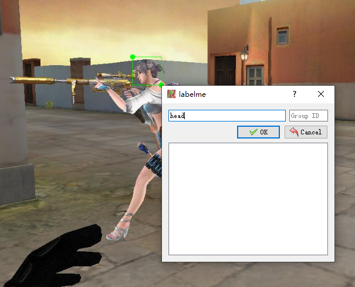
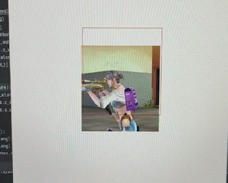
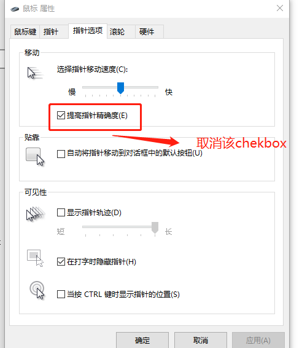

# Botshot 
**该项目仅供学习交流，一旦发现应用商业牟利的会追究其责任。**

**该项目并非外挂，仅仅是深度学习应用到实际中的一种体现，如有侵权立即删除。**

这个项目主要想由零开始讲述一个基于目标检测的项目是如何实现的。制作的功能参考了之前Youtube中比较火的FPS游戏自动射击。项目基于 Python, Pytorch, YOLOv5 来实现。
效果如下：
<p align='center'>  
    
</p>


该项目主要分为几个部分：
- 如何直接使用？
- 如何自己制作数据集
- 一些 win 应用的技术背景介绍
- 怎么使用 YOLOv5
  - 训练 YOLOv5
  - 将 YOLOv5 应用到 Botshot中

## 如何直接使用
1. 先开启 FPS 游戏，(该项目\*F为例，所提供的 weight 权值是基于该游戏分格训练的)
2. `python3 pygame_test.py`

## Make the costume training set
### 使用 labelme 制作自定义数据集
[Labelme Github](https://github.com/wkentaro/labelme)

可以先进入游戏，然后全屏截图，得到一组粗的数据集，图像大小取决于显示的分辨率大小，这里以`1920 x 1080` 为例。
<p align='center'>  
    
</p>

### 转换成 YOLO项目中 txt 格式
在YOLO中使用的格式为：
`class_id, x_center, y_center, width, height` 且是 `.txt` 格式; 其中 `class_id` 为分类的标识，`x_center, y_center` 是 `bbox` 的中心点。特别需要注意的是，值是相对值而不是绝对值，所谓相对值指的是相对于整幅图像的大小。
坐标为 width 对应的 x， height 对应 Y。

但是 labelme 得到的的是 `x_top_left, y_top_left, x_bot_left, x_bot_right` 是 `json` 格式，需要转换成YOLO的格式。


读取json 并且转换可以参考 `transjs2txt.py` 文件。

## 训练 Yolov5网络
该项目采用的是 YoLoV5 来实现目标检测。
[YoloV5 Github](https://github.com/ultralytics/yolov5)

`yml` 文件有两个 分别是 `data` 下面的配置文件，需要指出数据位置，以及分类个数。
```yml
path: ../datasets/cf256  # dataset root dir
train: images  # train images (relative to 'path') 128 images
val: images  # val images (relative to 'path') 128 images
test:  # test images (optional)

# Classes
nc: 1  # number of classes
names: ['head']  # class names

```
另一个是 model 配置，定义模型的结构，可以从 yolo5s.yml 拓展。需要修改的是

```yml
nc: 1  # number of classes
```

运行
```bash
python train.py --img 256 --batch 16 --epochs 35 --data cf256.yaml --weights yolov5s.pt --cfg yolov5scf.yaml --name cfauto
```
就可以开始训练。

## 使用训练好的 Yolov5 实现自动射击
训练好的 权值.pt 文件会在 `run/name/weights/` 下面

### pygame 以及一些 win api
由于我们只是想让 botshot 对于屏幕中间某一块 window 进行反应，而不是整个屏幕中的目标进行自动射击(如果是全屏范围，在多目标会出现视角晃动严重的问题，体验不好)。
同时我们需要在屏幕显示中做一些适当的交互，因此我们需要进行功能一些添加。
<p align='center'>  
    
</p>

这里使用的是 pygame 的包来进行功能的完善。其中涉及了一些 win api 的应用。
```python
def pygame_wind():
    pygame.init()
    screen_width = 500  # 整个 pygame 窗口的大小定义
    screen_height = 500 
    sm_width = 256   # pygame 显示窗口的大小
    sm_height = 256
    _, _, Desk_width, Desk_height = win32gui.GetClientRect(win32gui.GetDesktopWindow())  # 获取显示器的分辨率
   
    # 定义几个颜色
    fuchsia = (255, 0, 128)
    dark_red = (139, 0, 0)
    dark_y = (139, 128, 0)

    screen = pygame.display.set_mode((screen_width, screen_height), pygame.NOFRAME)  #创建一个名为screen的窗口
    pygame.display.set_caption("Transpose wind")  # 设置当前窗口标题

    # Create layered window
    hwnd = pygame.display.get_wm_info()["window"]

    # 让pygame窗口 一直在 windows 窗口程序的最前面
    SetWindowPos = windll.user32.SetWindowPos

    # 设置 pygame 窗口位置是显示器中心
    SetWindowPos(pygame.display.get_wm_info()['window'], -1, (Desk_width-screen_width)//2, (Desk_height-screen_height)//2, 0, 0, 0x0001)

    # 让 pygame 变成透明
    win32gui.SetWindowLong(hwnd, win32con.GWL_EXSTYLE, win32gui.GetWindowLong(hwnd, win32con.GWL_EXSTYLE) | win32con.WS_EX_LAYERED)
    # Set window transparency color 建纯色背景色, win32 使得该纯色为透明色
    win32gui.SetLayeredWindowAttributes(hwnd, win32api.RGB(*fuchsia), 0, win32con.LWA_COLORKEY)
    
    screen.fill(fuchsia)  # 让 fuchsia 的地方变为透明色。注意避免颜色冲突
    
    # 开始游戏的主循环

      while True:
        for envent in pygame.event.get():  # 监听用户事件
            if envent.type == pygame.QUIT:  # 判断用户是否点击了关闭按钮
                sys.exit()  # 用户退出
        
        .... # 程序主循环

        #画作用红框
        pygame.draw.rect(screen, dark_red, pygame.Rect(focus_area_screen_left, focus_area_screen_top, sm_width, sm_height), 1)

        pygame.display.update()  # 每次刷新
```

有几个地方需要注意：
1. 整个 pygame 大小其实是 500 $\times$ 500 大小
2. 作用区域只是 pygame window 中 256 $\times$ 256 大小的区域
3. 透明色填充需要指明透明色的颜色值，这里是 fuchsia


### Load YOLOv5 模型
加载 YOLO 模型有两种方法。
第一种可以直接从官方库中 load 进来，非常方便，完整封装。

```python
model_path = r"./yolov5-master/runs/train/cfauto/weights/best.pt"

model = torch.hub.load('ultralytics/yolov5', 'custom', path=model_path)
```
定义好模型的权值路径，然后直接使用 `torch.hub.load` load 模型，后续直接推理。

第二种更加底层一点，需要有一些目标检测的知识背景。

需要使用到 `yolov5-master/models/common.py` 中提供的 `DetectMultiBackend` 类 会更具提供的 ckpt  文件来进行自适应load 

```python
from models.common import DetectMultiBackend
from utils.general import non_max_suppression
model_path = r"./yolov5-master/runs/train/cfauto/weights/best.pt"

model = DetectMultiBackend(weights, device=device, dnn=False)
```

### 获取目标图像以及进行目标检测

首先要获取桌面图像，输入进网络中。这里以上述第二中推理方法为例子。
```python
from PIL import ImageGrab
full_img = ImageGrab.grab()  # 获取桌面整幅图像

# 作用window左上位置
focus_area_left = int(Desk_width / 2 - sm_width / 2)
focus_area_top = int(Desk_height / 2 - sm_height / 2)
focus_area = np.array(full_img)[focus_area_top:focus_area_top + sm_height,
             focus_area_left:focus_area_left + sm_width]
focus_area_screen_left = screen_width / 2 - sm_width / 2
focus_area_screen_top = screen_height / 2 - sm_height / 2

focus_area = np2Tensor(focus_area/255.0).unsqueeze(0).cuda()

# 网络推理
pred = model(focus_area, augment=False, visualize=False)

# 或者直接使用 hub.load 的模型来进行推理。
# results = model(focus_area, sm_height)  # custom inference size

# 非极大值抑制
pred = non_max_suppression(pred, 0.25, 0.45, None, False, max_det=10)
```
其中 `pred` 得到的是 `xmin, ymin, xmax, ymax, conf, class_name` 的 list，可以参考下面代码进行提取。并且将 bbox 画出可视化。

```python
for i, det in enumerate(pred):
    if len(det):
        pred = det.cpu().numpy()
        # for bbox in pred:
        xmin, ymin, xmax, ymax, conf, class_name = pred[0]
        if conf > 0.5:
            bbox_w = xmax - xmin
            bbox_h = ymax - ymin            
            screen.fill(fuchsia)
            pygame.draw.rect(screen, dark_y, pygame.Rect(focus_area_screen_left+xmin, focus_area_screen_top+ymin,
                                                         bbox_w, bbox_h), 1)

```

### 实现自动射击
对于 YOLO 检测到的 bbox 来实现自动射击。需要调要一些 win api，并且是在**管理员权限**下面运行该 python 脚本。
需要注意的是，YOLO 中提取到的位置是**相对于作用框中的位置**。需要对位置进行**转换**得到屏幕的**绝对位置**。
```python
# YOLO 提取 bbox 的中心点的相对位置。
center_x = xmin + bbox_w // 2
center_y = ymin + bbox_h // 2

# 获取当前鼠标绝对位置
cur_x, cur_y = pyautogui.position()

# 将相对位置 转换为 绝对位置
center_x_abs = center_x + focus_area_left
center_y_abs = center_y + focus_area_top

# 移动鼠标
MoveMouse(int(center_x_abs - cur_x), int(center_y_abs - cur_y))

# 鼠标在 bbox 中的话，射击10次，不再射击
if mouse_in_bbox((cur_x, cur_y),
                     (center_x + focus_area_left, center_y + focus_area_top, bbox_h, bbox_w)):
    if shotCounter < 1:
        pyautogui.click()
        shotCounter = 10
    else:
        shotCounter -= 1
```

## 使用步骤
- 鼠标的设置需要修改，把这个提高精度给取消掉，因为该选择会让鼠标拥有惯性，影响滑动时绝对位置定位。
<p align='center'>  
    
</p>

- 打开游戏
- **将游戏中鼠标移动速度将为 1-4 之间**
- 使用**管理员权限**运行 test.py 脚本
 
```bash
python3 test.py --cfg /yolov5-master/models/yolov5scf.yaml --img 256
```